# 编写 SVG 的口袋指南

## 简介

Scalable Vector Graphics (SVG)是在XML中描述二维图形的语言。这些图形由路径，图片和（或）文本组成，并能够在不失真的情况下任意变换尺寸。

本书主要介绍了内联SVG，它是指在HTML中编写的嵌入式代码，以便在浏览器中生成这些图形。

以这种方式使用SVG有许多优点，包括为了交互目的访问所有图形的各个部分，支持访问 SVG 文档构成的 DOM 节点树，查询、修改 DOM 节点的属性，提升用户可访问性。

先介绍基本组织和简单形状，再继续描述SVG坐标系或画布，然后用它绘制图形的内部和/或边框，变换，以及使用和操作图形文本。通过渐变和模式等更高级的功能来总结。

这个指南快速且详细的介绍内联式SVG以及所有涵盖的可使用的功能，有助于你学习SVG。 它面向设计师和开发人员，希望以最可行的方式将SVG添加到他们的工作流程中。

从小笔画细节到开始使用手工制作的模式，本指南旨在成为一个围绕“go-to”编写SVG的参考。

### 前言

本“口袋指南”只针对已经有一些HTML和CSS基础的人，在你喜爱的浏览器中绘制SVG之前最好知道一些额外的知识, 例如：在SVG中正确渲染的信息，如何让你的图形更容易访问，以及何时何处使用矢量图形软件。

#### 使用SVG

[有许多方法可以把SVG插入到你的项目](//css-tricks.com/using-svg/)：内联、`img`、`background-image`、`<object>`或者`Data URI`。我们主要介绍内联SVG的使用方法，包括如何在结构清晰的HTML文档中编写SVG代码。

尽管我们只是介绍了内联SVG的使用方法，但在某些特定情况下，其他方法也许会更好。例如，如果你不需要图形本身的编辑功能或访问其各个部分，则用``标签可能更适合。

#### 矢量图形软件

当你想要创建几乎不可能手写的更复杂的图形时，矢量图形软件更实用。你可以将[Adobe Illustrator](//www.adobe.com/products/illustrator.html), [Inkscape](//www.inkscape.org/en), [Sketch](//bohemiancoding.com/sketch), [iDraw](//www.indeeo.com/idraw)和 [WebCode](//www.webcodeapp.com)这些工具放到你的SVG技能包中。

可以用这些工具直接导出SVG代码并嵌入你的HTML。我们过一会再讨论这个。

#### Web中的内联SVG

为了简洁起见，SVG DOCTYPE，版本号，[`xmlns`](//www.w3.org/TR/REC-xml-names)和[`xml：space`](//www.w3.org/TR/2004/REC-xml11-20040204/#sec-white-space)在这本书中不会被提到。

这些属性专注于[SVG的版本](//www.w3.org/TR/xml11)和文档的[命名空间](//www.w3.org/TR/REC-xml-names)。只要记住这一点，你不需要这些属性就能成功地在浏览器中呈现图形。 

如下面这个例子，在Illustrator生成的SVG代码时不要吃惊：

	<!DOCTYPE svg PUBLIC "-//W3C//DTD SVG 1.1//EN" "http://www.w3.org/Graphics/SVG/1.1/DTD/svg11.dtd">
	<svg version="1.1" xmlns="http://www.w3.org/2000/svg" xmlns:xlink="http://www.w3.org/1999/xlink" xml:space="preserve">
	</svg>

在大多数情况下，`<svg>`元素中的`DOCTYPE`和属性不是必需的，可以删除，以缩减你的代码。

#### SVG用户可访问性

使用[SVG可访问性](//www.sitepoint.com/tips-accessible-svg)是一个好习惯，但是为了简洁，描述和标题不会包含在整本书的代码中。

一旦你更熟练的写SVG，这些元素将使你的图形更能被用户接受。例如，`<desc>`元素中的内容允许你向屏幕阅读器的用户提供图形的详细描述。

由于SVG文本可以被检测和读取，并且可以容易地调整大小以适应特定的阅读偏好，提供了在可访问性方面优于传统的基于光栅的图像的巨大优势。

#### 注意事项

使用之前一些更通用的注释：整本书的演示字体都可通过[Google Fonts](//www.google.com/fonts)获得。虽然你可以通过`font-family`看到这些字体显示出来，但你不会看到获取谷歌字体时使用的相关`link`或`@import`。

示例始终使用像素和百分比作为单位标识符。 SVG支持的长度单位为：`em`，`ex`，`px`，`pt`，`pc`，`cm`，`mm`，`in`和百分比。

本书中的SVG代码可以添加到任何文本编辑器，并且在[任何支持内联SVG的浏览器](//caniuse.com/svg-html5)中查看。通常情况下浏览器支持对于SVG非常强大，但是有更多高级的特性（例如渐变）时这种支持会变得弱一些。[Can I Use](//caniuse.com)是一个检查功能支持的实用网站，但实践才是检验真理的唯一方法。

你也可以复制代码，通过[CodePen](//codepen.io)把它放在一个HTML部分，就能立即在屏幕上看到你的图形。我说的可能不够好，但它是我对SVG感兴趣的第一因素。练习，修改甚至失败是我最喜欢的学习方式。

最终，由于篇幅限制，一部分例子会有图形代码注释，其他不想关的将被省略。

	<svg>
		<!--<path d=<this path is commented out> />-->
	</svg>

## 第1节： 文档组织

SVG详细信息位于`<svg>`元素中。此元素中有几个属性，可以自定义你的图形画布。虽然这些属性对于呈现图像不是完全必要的，但是在跨浏览器执行时忽略它们可能使更复杂的图形易受攻击，并且使得它们容易不按预期进行呈现。

如上所述，内联图形可以“手动”编写，或者通过矢量图形软件生成的`XML`代码来嵌入。因为这些图形元素的顺序决定了它们的堆叠顺序，所以无论哪种方式，正确的组织和结构对于编写高效的SVG代码至关重要的。

### 组织和语义

SVG文档片段由`<svg>`元素中包含的任意数量的SVG元素组成。本文档中的组织是至关重要的。文档中的内容可以快速扩展，正确的组织提高了可访问性和效率，使作者和用户都受益。

本节将介绍编写SVG的关键 —— `<svg>`元素 —— 并查看帮助初始文档设置的一些常见属性。

#### `svg`元素

`<svg>`元素归属于容器和结构元素，在文档内允许嵌套使用独立的SVG片段。每个独立的片段都有自己的坐标系。

此元素中使用的属性（如`width`，`height`，`preserveAspectRatio`和`viewBox`）定义正在写入图形的画布。

当从某些矢量软件获得SVG代码时，在`<svg>`元素中有很多[附加信息](//www.w3.org/TR/SVG/struct.html#SVGElement)，例如SVG版本号（指示正在使用的SVG语言版本）和`DOCTYPE`。正如我已经提到的，这些信息不会包括在本指南的示例中，缺少它们不会阻止你的图形在屏幕上呈现。

#### `g`元素

`g`元素是组合相关图形的容器元素。将此元素与描述和标题元素结合使用提供图形的相关信息，并将相关图形组件分在同一组在一起提高访问性。 

此外，通过相关元素分在同一组，可以将它们看作一个整体与各个独立的部分。移动这些元素尤其方便，例如，可以移动整个组。 

不包含在`g`中的任何元素则认为有它们自己的组。

#### `use`元素

`<use>`元素允许您在整个文档中重复使用元素。此元素中可以包含其他属性，例如`x`，`y`，`width`和`height`，这些属性定义图形在坐标系中的详细映射位置。 

在这里使用`xlink:href`属性可以调用要重用的元素。例如，如果存在需要重新使用的苹果的图像的`apple`的`id`的`<g>`，则该图像可以由`<use>`：`<use x =“50”y =“50” xlink:href =“＃apple”/>`。 

这个元素作为一个重要的时间保护程序帮助压缩代码。

#### `defs`元素

虽然`<use>`允许重用已经渲染的图形，但`<defs>`元素中的图形不会渲染到画布上，而是能够被引用，然后通过使用`xlink:href`来渲染。 

图形在`<defs>`中定义，然后可以通过引用该图形的`id`在整个文档中使用。 

例如，下面的代码绘制一个非常简单的矩形渐变：

	<svg>
    	<defs>
      		<linearGradient id="Gradient-1">
        		<stop offset="0%" stop-color="#bbc42a" />
        		<stop offset="100%" stop-color="#765373" />
      		</linearGradient>
    	</defs>
    	<rect x="10" y="10" width="200" height="100" fill= "url(#Gradient-1)" stroke="#333333" stroke-width="3px" />
  	</svg>

`<defs>`除非引用其唯一的`id`来调用，不然内容没有直观的输出，在这个实例中通过矩形的`fill`属性完成内容渲染。

#### `symbol`元素

`<symbol>`元素类似于`<g>`，因为它提供了一种组元素的方法，但是，如果没有使用`<use>`元素，`<symbol>`中的元素没有可视化输出（如`<defs>`）。 

它也不同于`<g>`元素，`<symbol>`建立自己的坐标系，与渲染的视口分开。 

SVG的`viewport`和`viewBox`共同建立被映射的图形的坐标系统，将进一步介绍不同的部分。

### 堆叠顺序

HTML中的其他元素的堆叠顺序可以CSS中的`z-index`操纵，但SVG不能。 SVG元素的堆叠顺序完全取决于它们在文档片段中的位置。 

下面的葡萄和西瓜在同一个`<svg>`元素中。西瓜出现在葡萄前面，因为文档中包含组成西瓜的路径的组被列在葡萄之后。

	<svg>
		<g class="grapes">
			<!--<path <stem path> />-->
			<!--<path <grapes path> />-->
			<!--<path <leaf path> />-->
		</g>
		<g class="watermelon">
			<!--<path <outside path> />-->
			<!--<path <inside path> />-->
			<!--<path <seeds path> />-->
		</g>
	</svg>

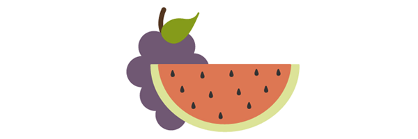

如果包含葡萄的组被移动到文档的末尾，它将出现在西瓜的前面。

	<svg>
		<g class="watermelon">
			<!--<path <outside path> />-->
			<!--<path <inside path> />-->
			<!--<path <seeds path> />-->
		</g>
		<g class="grapes">
			<!--<path <stem path> />-->
			<!--<path <grapes path> />-->
			<!--<path <leaf path> />-->
		</g>
	</svg>

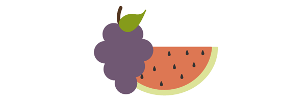

这种定型的堆叠顺序的方法也适用于组内的每一个元素。例如，将葡萄的茎的路径移动到组的末尾将导致茎在顶部。

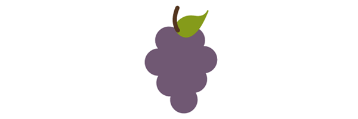

## 第2节：基本图形和路径

当你需要在HTML中使用更复杂的内联SVG图形时就没有办法再手工编写了。那些更复杂的图形可以使用矢量软件创建，但现在我们来学习下手动编码的基础。

### 基本图形

SVG包含以下基本形状元素集：**矩形，圆形，椭圆形，直线，折线和多边形**。每个元素在渲染之前需要一些属性，如坐标和大小等详细信息。

#### 矩形

`<rect>`元素定义一个矩形。

	<svg>
  		<rect width="200" height="100" fill="#BBC42A" />
	</svg>

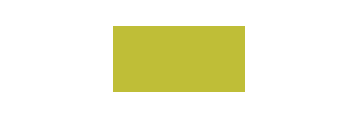

`width`和`height`属性确定矩形的大小，而`fill`则设置形状的内部颜色。数值默认为`px`，当未指定时，`fill`将默认为`black`。 

其他属性还有`x`和`y`坐标。这些值将图形沿`<svg>`元素对应的轴移动相应的距离。

也可以通过指定`rx`和`ry`属性中的值来创建圆角。例如，`rx =“5” ry =“10”`将产生具有`5px`半径的角的水平边，以及具有`10px`半径的角的垂直边。

#### 圆形

基于中心点和外半径设置`<circle>`元素。

	<svg>
  		<circle cx="75" cy="75" r="75" fill="#ED6E46" />
	</svg>

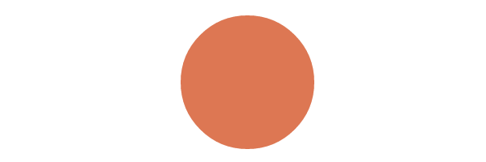

`cx`和`cy`坐标建立圆的中心相对于由`<svg>`设置的工作空间尺寸的位置。

`r`属性设置外半径的大小。

#### 椭圆

`<ellipse>`元素基于中心点和两个半径定义椭圆。

	<svg>
  		<ellipse cx="100" cy="100" rx="100" ry="50" fill="#7AA20D" />
	</svg>

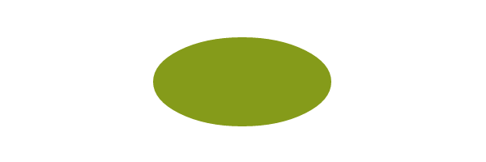

当`cx`和`cy`值基于到SVG坐标空间中的像素距离建立中心点时，`rx`和`ry`值定义形状的边的半径。

#### 直线

`line`元素定义具有开始点和结束点的直线。

	<svg>
  		<line x1="5" y1="5" x2="100" y2="100" stroke="#765373" stroke-width="8"/>
	</svg>

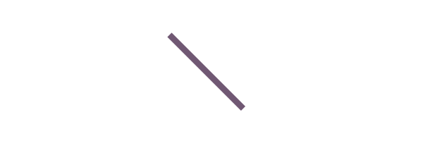

`x1`和`y1`值确定线的开始坐标，而`x2`和`y2`值确定线的结束坐标。

#### 折线

`<polyline>`元素定义了一组相连的直线段，通常构成开放形状（不连接的开始点和结束点）。

	<svg>
  		<polyline points="0,40 40,40 40,80 80,80 80,120 120,120 120,160" fill="white" stroke="#BBC42A" stroke-width="6" />
	</svg>

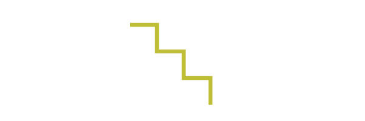

在整个形状中`points`的值在`x`和`y`轴上建立形状的位置，并且在整个值列表中被分组为`x`，`y`。

不能使用奇数点。

#### 多边形

`<polygon>`元素定义由连接的线组成的闭合形状。

	<svg>
  		<polygon points="50,5 100,5 125,30 125,80 100,105 50,105 25,80 25,30" fill="#ED6E46" />
	</svg>

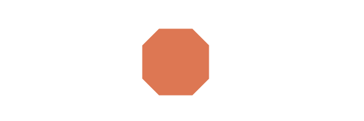

多边形形状的点通过八组的`x`，`y`值来定义。

该元素还可以根据点的数量产生其他闭合形状。

### `path`元素

SVG路径表示形状的轮廓。此形状可以填充，描边，并用于导航文本和/或用作剪切路径。

当涉及许多[曲线](//www.w3.org/TR/SVG/paths.html#PathDataCurveCommands)时，这个路径会变得非常复杂。然而，理解工作原理和涉及的语法将有助于管理这些特定路径。

#### `path`数据

路径数据包含在`<path>`元素内的`d`属性中，定义了形状的轮廓：`<path d =“<path data specifics>”/>`。 

`d`属性中的这些数据说明了路径的`moveto`，`line`，`curve`，`arc`和`closepath`指令。

下面的`<path>`详细信息定义了青柠图形的路径细节：

	<svg width="258px" height="184px">
  		<path fill="#7AA20D" stroke="#7AA20D" stroke-width="9" stroke-linejoin="round" d="M248.761,92c0,9.801-7.93,17.731-17.71,17.731c-0.319,0-0.617,0-0.935-0.021c-10.035,37.291-51.174,65.206-100.414,65.206 c-49.261,0-90.443-27.979-100.435-65.334c-0.765,0.106-1.531,0.149-2.317,0.149c-9.78,0-17.71-7.93-17.71-17.731 c0-9.78,7.93-17.71,17.71-17.71c0.787,0,1.552,0.042,2.317,0.149C39.238,37.084,80.419,9.083,129.702,9.083	c49.24,0,90.379,27.937,100.414,65.228h0.021c0.298-0.021,0.617-0.021,0.914-0.021C240.831,74.29,248.761,82.22,248.761,92z" />
	</svg>

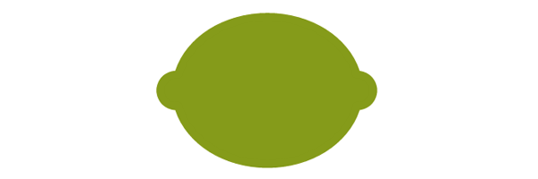

##### `moveto`

`moveto`命令（`M`或`m`）建立一个新的点，就像提起一支钢笔，并在纸上一个新位置绘制。包括路径数据的代码行必须以`moveto`命令开始，如上面的例子所示。

`moveto`命令跟在初始化路径之后，代表新子路径的开始和复合路径的创建。这里的大写字母`M`表示绝对坐标，小写字母`m`表示相对坐标。

##### `closepath`

`closepath`（`Z`或`z`）表示当前子路径的结束，并从该点到路径的初始点绘制直线。 

如果`closepath`之后紧跟着一个`moveto`，这些`moveto`坐标表示下一个子路径的开始。如果这个相同的`closepath`之后是`moveto`之外的任何东西，则下一个子路径从当前子路径的点开始。 

这里大写或小写`z`没有区别。

##### `lineto`

`lineto`命令从当前点到新点绘制直线。

###### `L`, `l`

`L`和`l`命令从当前点绘制一条线到下一个提供的点坐标。这个新点然后变成当前点，以此类推。 

大写`L`表示绝对定位，而小写`l`是相对定位。

###### `H`, `h`

`H`和`h`命令从当前点绘制水平线。

大写`H`表示绝对定位，而小写`h`是相对定位。

###### `V`, `v`

`V`和`v`命令从当前点绘制垂直线。

大写`V`表示绝对定位，而小写`v`是相对定位。

##### 曲线命令

有三组命令绘制曲线路径：**CubicBézier**（`C`，`c`，`S`，`s`），**二次贝塞尔**（`Q`，`q`，`T`，`t`）和**椭圆弧**（`A`，`a`）。 

以下曲线部分将介绍每条曲线命令的基本概念，和映射的详细信息，然后提供一个图表供进一步了解。

###### Cubic Bézier

`C`和`c` **CubicBézier**命令从当前点绘制曲线，使用`(x1，y1)`参数作为曲线开始处的控制点，`(x2，y2)`作为结束处的控制点，定义形状细节曲线。

`S`和`s`命令还绘制立方贝塞尔曲线，但在这种情况下，存在第一控制点是第二控制点的反射的假设。 

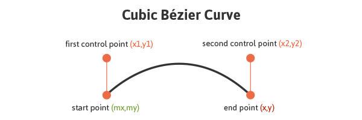

下面的代码绘制了一个基本的CubicBézier曲线：

	<svg>
  		<path fill="none" stroke="#333333" stroke-width="3" d="M10,55 C15,5 100,5 100,55" />
	</svg>

该曲线的第一和最后一组值将影响其开始和结束位置，两个中心值将影响曲线本身在开始和结束时的形状和定位。

`S`和`s`命令也绘制立方贝塞尔曲线，但在这种情况下，假设第一个控制点是前一个`C`命令的最后一个控制点的反映。则会作为相对于`S`命令的开始点。

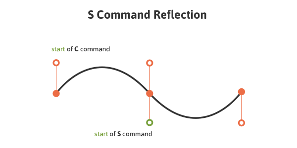

大写字母`C`表示绝对定位，而小写字母`c`是相对定位。`S`和`s`也是一样。

###### Quadratic Bézier

二次贝塞尔曲线（`Q`，`q`，`T`，`t`）类似于立方贝塞尔曲线，除了它只有一个控制点。

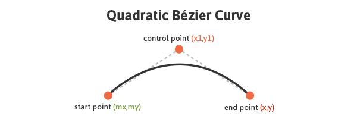

以下代码绘制了一个基本的二次贝塞尔曲线：

	<svg>
  		<path fill="none" stroke="#333333" stroke-width="3" d="M20,50 Q40,5 100,50" />
	</svg>

操作第一个和最后一组值`M20,50`和`100,50`会影响曲线起点和终点的位置。中心值集`Q40,5`定义曲线的控制点，确定其形状。

`Q`和`q`使用`(x1，y1)`作为控件从初始点到终点绘制曲线。 `T`和`t`通过假设控制点是相对于新的`T`或`t`命令的开始点的先前列出的命令的控制的反映，从初始点到终点绘制曲线。

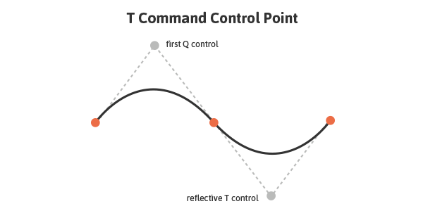

大写的`Q`表示绝对定位，而小写的`q`是相对定位。`T`和`t`也是一样。

###### Elliptical Arc

椭圆弧（`A`，`a`）定义椭圆的线段。这些段通过`A`或命令创建，通过指定起点，终点，`x`和`y`半径，旋转和方向创建弧。

下面是一个基本椭圆弧的代码：

	<svg>
  		<path fill="none" stroke="#333333" stroke-width="3" d="M65,10 a50,25 0 1,0 50,25" />
	</svg>

该路径中的第一和最后一组值，`M65,10`和`50,25`表示初始和最终坐标，而第二组值定义两个半径。 `1,0`（大弧标志和顺时针标志）的值确定如何绘制圆弧，因为这里有四个不同的选项。 

下图显示了四个弧选项以及大弧标志值和顺时针标志值对弧段的最终渲染的影响。

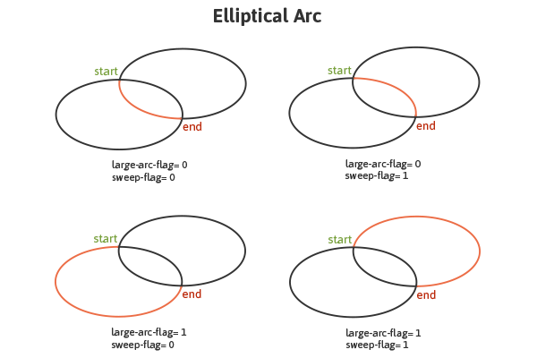

### 矢量软件嵌入

矢量图形软件可以制作更复杂的形状和路径，同时可以导出SVG代码在其他地方使用和操作。

一旦图形完成，生成的XML代码可以被复制并嵌入到HTML中，图形越复杂代码越长。分解SVG的每个部分并且运用适当的组织元素可以极大地帮助引导和理解这些复杂和冗长的代码。

这里是一些樱桃的SVG代码图像，添加了引导类：

	<svg width="215px" height="274px" viewBox="0 0 215 274">
		<g>
			<path class="stems" fill="none" stroke="#7AA20D" stroke-width="8" stroke-linecap="round" stroke-linejoin="round" d="M54.817,169.848c0,0,77.943-73.477,82.528-104.043c4.585-30.566,46.364,91.186,27.512,121.498" />
			<path class="leaf" fill="#7AA20D" stroke="#7AA20D" stroke-width="4" stroke-linecap="round" stroke-linejoin="round" d="M134.747,62.926c-1.342-6.078,0.404-12.924,5.762-19.681c11.179-14.098,23.582-17.539,40.795-17.846 c0.007,0,22.115-0.396,26.714-20.031c-2.859,12.205-5.58,24.168-9.774,36.045c-6.817,19.301-22.399,48.527-47.631,38.028 C141.823,75.784,136.277,69.855,134.747,62.926z" />
		</g>
		<g>
			<path class="r-cherry" fill="#ED6E46" stroke="#ED6E46" stroke-width="12" d="M164.836,193.136 c1.754-0.12,3.609-0.485,5.649-1.148c8.512-2.768,21.185-6.985,28.181,3.152c15.076,21.845,5.764,55.876-18.387,66.523 c-27.61,12.172-58.962-16.947-56.383-45.005c1.266-13.779,8.163-35.95,26.136-27.478	C155.46,191.738,159.715,193.485,164.836,193.136z" />
			<path class="l-cherry" fill="#ED6E46" stroke="#ED6E46" stroke-width="12" d="M55.99,176.859 c1.736,0.273,3.626,0.328,5.763,0.135c8.914-0.809,22.207-2.108,26.778,9.329c9.851,24.647-6.784,55.761-32.696,60.78 c-29.623,5.739-53.728-29.614-44.985-56.399c4.294-13.154,15.94-33.241,31.584-20.99C47.158,173.415,50.919,176.062,55.99,176.859z" />
		</g>
	</svg>

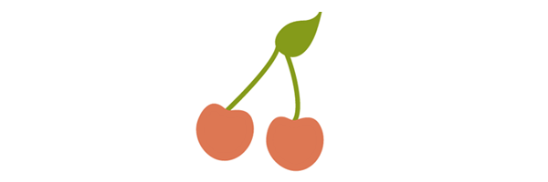

`svg`元素中的属性定义工作区，或图形的“画布”。叶和茎在一个`g`（组）内，而樱桃在另一个。数字字符串定义图形将采用的路径，`fill`和`stroke`属性设置背景和边框的颜色。

将这个代码复制下来，它会通过一个SVG优化器在被放置在HTML之前，以助于消除不必要的代码和间距，进而大大缩小文件。 关于这个方面[Peter Collingridge的SVG Optimiser](//petercollingridge.appspot.com/svg-optimiser)和[SVGO](//github.com/svg/svgo)也是非常有用的工具。

## 第3节: 工作区域

或许SVG中最重要的方向是了解它的总结结构，以及如何创建基本图形，然而要掌握这些就需要掌握SVG的工作区，或者换句话说，图形将映射到工作区的坐标系统。

理解SVG的工作区有助于帮你更好的，更正确的呈现您的作品，但是一旦进入了高级的SVG特性时，这个就变得非常重要。例如，渐变和图案的映射需要严重的依赖已建立的坐标系统。这个工作区域主要由SVG的`viewport`和`viewBox`属性来定义。

幸运的是，这个梨图形配置了相应的`viewport`和`viewBox`：

	<svg width="115" height="190" viewBox="0 0 115 190">
    	<!--<path <pear's drawing path> />-->
  	</svg>

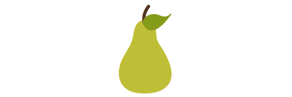

*[点击这里查看Demo效果](//codepen.io/jonitrythall/pen/3a8c995a969cbcbc5c589aa9ad7de491)*

整个梨在浏览器中都可见，但当`viewport`发生变更时，这个梨的图形也将想应的会进行绽放。

### `viewport`

`viewport`是用来设置SVG可见区域。虽然SVG正如你期望的一样设置了`width`或`height`属性，但设置了`viewport`将意味着图像中只有某个部分可以在SVG的工作区域可见。

通过`<svg>`元素的`height`和`width`属性可以设置`viewport`。

如果这些值没有显式定义，那么`viewport`的大小通常由SVG中的其他指标来决定，比如`SVG`外面元素的宽高。只不过，离开这个不确定的地方（指的是不确定的SVG的`viewport`），我们的图形（艺术作品）就很容易被截断。

### `viewBox`

`viewBox`允许你指定一组图形拉伸以适应特定的容器元素。这些值包括由逗号和空格分隔的四个数字：`min-x`、`min-y`、`width`和`height`，这些数字通常设置为`viewport`的边界值。

`min`值表示在`viewBox`的图形应该从哪个点开始，而`width`和`height`用来确定盒子的大小。

如果我们不显式的定义`viewBox`，那么图形将无法与设置的`viewport`相匹配。

如果`viewBox`的`width`和`height`大小比梨图形各小`50px`，那么梨的可见部分就会减少，其剩下的部分则会缩放到`viewport`的边界。

	<svg width="115px" height="190px" viewBox="0 0 65 140">
		<!--<path <pear's drawing path> />-->
	</svg>

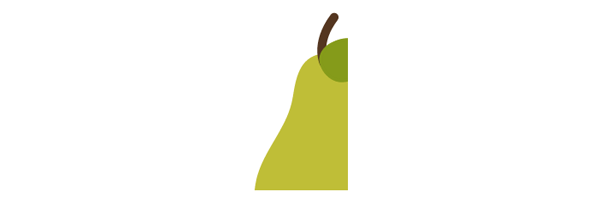

*[点击这里查看Demo效果](//codepen.io/jonitrythall/pen/a1f47ea097e886493cf1d483629e655a)*

`viewBox`中的`min`值定义了其父元素中的`viewBox`的原始值。换句话说，在`viewBox`中，你希望它匹配`viewport`的开始点。在上面的梨图形中，`min`值设置为`0`（左上角）。让我们把这些值更改变`50,30`：`viewBox= 50 30 115 190`。

	<svg width="115" height="190" viewBox="50 30 115 190">
		<!--<path <pear's drawing path> />-->
	</svg>

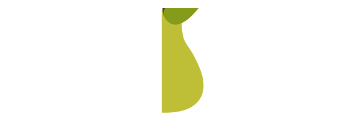

*[点击这里可以查看Demo效果](//codepen.io/jonitrythall/pen/46aaa8d7e8296945def4490ad5fd69d1)*

`viewBox`现在从`x`轴的`50px`处开始，从`y`轴的`30px`处开始。在改变这些值时，梨图形的部分已经改变了。

#### preserveAspectRatio

如果`viewport`和`viewBox`不具备相同的宽高比例，则`preserveAspectRatio`属性将指示浏览器如何显示图形。

`preserveAspectRatio`有两个参数，`<align>`和`<meetOrSlice>`。第一个参数包含两个部分，并在`viewport`中引导`viewBox`的对齐。第二个参数是可选的，并指出如何保持宽高比例。

	preserveAspectRatio="xMaxYMax meet"

这些值将把`viewBox`的右下角对齐到`viewport`的右下角。`meet`将会通过缩放`viewBox`来适应`viewport`，从而保持宽高比例。

`<meetOrSlice>`有三个选项：`meet`（默认值）、`slice`和`none`。在满足确保图形（尽可能多）的可见性的同时，`slice`尝试用`viewBox`填充`viewport`，然后将图形的任何部分切掉。`none`不会宽高比，图形会在`viewport`里扭曲。

也许这里最直接的值是`none`，这表明不会有统一的缩放。如果我们增加`viewport`的像素值，下面的樱桃图形将会拉伸不均匀，樱桃看起来会扭曲。

	<svg width="500" height="400" viewBox="0 0 250 600" preserveAspectRatio="none">
		<!--<path <cherry drawing path> />-->
	</svg>

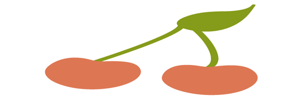

*[点击这里可以查看Demo效果](//codepen.io/jonitrythall/pen/8943154485dcb3662f95a6756f1d097b)*

下图中的`preserveAspectRatio`属性值设置为`xMinYMax meet`，它将`viewBox`的左下角和`viewport`的左下角对齐。`meet`是确保图像在`viewport`中尽可能的缩放。

	<svg width="350" height="150" viewBox="0 0 300 300" preserveAspectRatio="xMinYMax meet" style="border: 1px solid #333333;">
		<!--<path <cherry drawing path> />-->
	</svg>

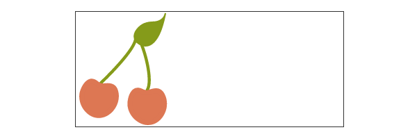

*[点击这里查看Demo效果](//codepen.io/jonitrythall/pen/9edd85f9931af23b30726845c184ee9b)*

当`meet`变为`slice`时，樱桃图形的效果：

	<svg width="350" height="150" viewBox="0 0 300 300" preserveAspectRatio="xMinYMax slice" style="border: 1px solid #333333;">
		<!--<path <cherry drawing path> />-->
	</svg>

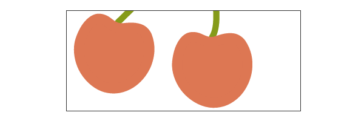

*[点击这里可以查看Demo效果](//codepen.io/jonitrythall/pen/2eede68379ac3f2702e5e30342a3ce0b)*

注意，对象值并无关联。

	<svg width="350" height="150" viewBox="0 0 300 300" preserveAspectRatio="xMinYMid slice" style="border: 1px solid #333333;">
		<!--<path <cherry drawing path> />-->
	</svg>

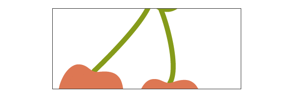

*[点击这里查看Demo效果](//codepen.io/jonitrythall/pen/63e0bed4bd9b7519da1c2f287963d4f6)*

上面的例子中`preserveAspectRatio`的值为`xMinYMid slice`，这些樱桃现在没有沿着`viewport`的`y`轴的中间方向排列。

### 坐标系统变换

使用`transform`可以让SVG的图形做旋转、缩放、位移和扭曲等操作。SVG作者可以将`transform`应用于单个元素或整个元素组。

在元素中使用`<transform>`属性，将这些变换函数用于SVG元素中。这个属性中包含多个函数，言外之外你可以使用多个变形，例如：`transform="translate(<tx>,<ty>) rotate(<rotation angle>)" />`。

在操作SVG变形时有一点需要特别注意，它将会影响您的坐标系统或工作区。这是因为[变形创建了一个新的用户空间](http://www.w3.org/TR/SVG/coords.html#EstablishingANewUserSpace)，本质上是复制原来的，然后将变形放置在新的系统本身上。

下图演示了在包含图形的组中进行`(100,100)`位移变形时发生的坐标系统变换。

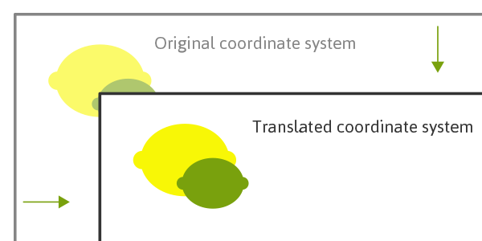

坐标系统本身已经位移了，而酸橙(lime)和柠檬(lemon)的两个图像在各自的系统中保持了原来的位置。新的用户坐标系统在原来的坐标系统中的`(100, 100)`位置处。

由于坐标系统的关系，这些函数将会移动图形，即使你没有直接在它上面设置`transition`。例如，将`scale`的值设置为`3`，将会试图将图形放大三倍，`x`和`y`的坐标都将会乘以`3`，而图形与它一起缩放，在整个过程中就会移动它。

也允许变换嵌套，在这种情况之下，效果将会被累积在一起。因此，子元素的最终变换将基于在它之前的变换的累积。

#### `translate`

`translate`函数指定一个图形的位移细节，两个数值直接指定图形在`x`和`y`轴上的位移：`transform="translate(<tx>,<ty>)"`。这些值可以由空格或逗号分隔。

这里的`y`值是可选的，如果忽略不设置，其值是`0`。

#### `rotate`

`rotate`的值将指定图形在其原点旋转的度数，而SVG的原点在左上角`(0,0)`：`transform="rotate(<rotation angle>)"`。

这里还有一个选项，包括`x`和`y`的值：`transform=rotate(<rotation angle> [<cx>,<cy>])`。如果提供了，这些值将建立一个新的旋转中心，而不是默认值`(0,0)`。

下图是一个苹果未做旋转和旋转`20deg`之后的效果：`transform="rotate(20)"`。**注意，此图像并不反映该旋转所产生的坐标变换。**

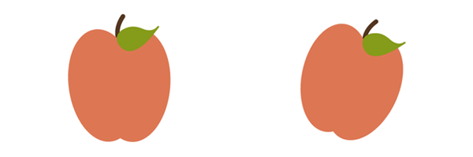

#### `scale`

通过`scale`函数可以调整SVG图形的缩放。该函数接受一个或两个值，其中指定了元素在`x`轴和`y`轴上的缩放值：`transform="scale(<sx> [<sy>])"`。

`sy`的值是可选的，如果未显式设置，它的值为`sx`，以确保正常调整图形大小。

`scale`的值如果是`.5`，图形将是原图形的一半大小，而`3`的值将会把原图形放大三倍。如果是一个`4,2`的值，图形的宽度是原图宽的四倍，高是原图高的两倍。

#### `skew`

通过使用`skewX`和`skewY`可以让SVG元素扭曲。这两个函数中包含的值表示沿对应轴做适当的倾斜变换。

下图是苹果图莆添加`skewX`值`20`：`transform="skewX(20)"`前后的效果。**注意，此图形不反映该变换所产生的坐标变化。**

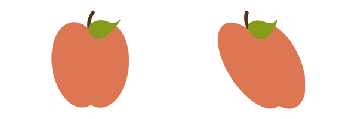

## 第4节: 填充和描边

`fill`和`stroke`允许我们填充SVG和绘制其边框。

[绘制(Paint)](//www.w3.org/TR/SVG/painting.html#Introduction)指的是通过`fill`和(或)`stroke`给SVG图形添加颜色、渐变或图案等。

### `fill`属性

`fill`属性就要用来绘制图形元素的内部。这个填充可以是纯色、渐变或图案。

图形内部是通过检查`fill-rule`中列出的所有子路径和规范来确定的。

当填充一个形状或路径时，`fill`将会画出一条开放的路径，就像路径的第一个点连接最后一个点一样，即使路径上的`stroke`颜色也不会被呈现。

#### `fill-rule`

`fill-rule`属性表示用于确定画布中哪些部分在形状内部的算法。在使用更复杂的交叉或封装路径时，这并不那么简单。

其接受的值主要有：`nonzero`、`evenodd`和`inherit`。

##### `nonzero`

`nonzero`的值决定了画布内的一个点，通过这个点的任意方向上绘制一条线，然后再考虑穿过这条线另一个部分形状的位置。这将从零开始，并在每次路径段从左到右的时候添加一个路径，每次路径段从右到左的时候再减去一次。

如果在计算和计算这些交集之后得到的结果是零，那么这个点就在路径之外，否则它就在里面。

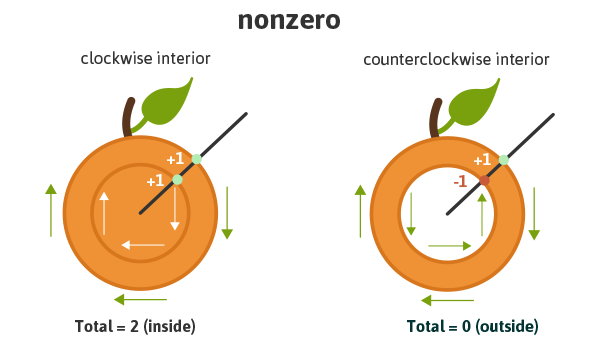

从本质上讲，如果将内部路径按顺时针方向画，它将被认为是内（`inside`），但如果按逆时针方向画，则会被讷为是外（`outside`），因此被排除在绘制之外。

##### `evenodd`

`evenodd`的值决定了画布上一个区域的内部，通过在任何方向上通过整个形状绘制一条线，并计算出线交叉的路径段。如果这个结果是奇数，那么这个点就在里面，如果是偶数，则这个点在外面。

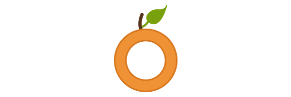

考虑到`evenodd`的具体算法，内部图形绘制的方向是无关的，这个与非零不同的是，只是在计算它们穿过直线时的路径。

虽然这个属性通常不是必需的，但是它将允许更大的`fill`，用于控制一个复杂的图形，如上所述。

##### `inherit`

`inherit`的值将引导元素接受其父元素指定的`fill-rule`。

#### `fill-opacity`

`fill-opacity`的值是指内部填充的不透明度。`0`表示完全透明，`1`表示不透明，两者之间的值代表了一个基于百分比的不透明度。

### 描边属性

在SVG中有许多与描边有关的属性，允许你在绘制图形时控制和操作描边的细节。这些属性提供的能力能让你更好的手工编写SVG代码，更好的控制绘制的图形。当需要对嵌入的图形进行编辑时，也能更方便的操作。

下面的例子使用了内联的SVG，绘制了一个葡萄。被使用的属性直接在图形元素当中。

#### `stroke`

`stroke`属性定义了特定图形和路径的边框。

比如下面的葡萄图形有一个紫色的描边效果：`stroke="#765373"`：

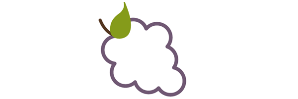

*[点击这里可以查看Demo效果](//codepen.io/jonitrythall/pen/c54df7a7715a7ca9163df9868c2ee699)*

#### `stroke-width`

`stroke-width`值设置了描边的粗累，比如使用此属性设置葡萄描边的粗细，如上图的紫色葡萄，它的值就设置了`6px`。

该属性的默认值为`1`。如果使用百分比值，将会基于`viewport`的尺寸来进行计算。

#### `stroke-linecap`

`stroke-linecap`定义了开放路径的终点（也称为线帽），其有四个值：`butt`、`round`、`square`和`inherit`。

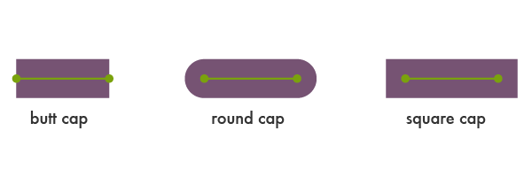

`inherit`的值将指定元素继承其父元素指定的`stroke-linecap`。

下图是葡萄茎图形的`stroke-linecap`设置为`square`的效果：

	<svg>
    	<!--<path <path for grapes> />-->
    	<!--<path stroke-linecap="square" <path for stem> />-->
    	<!--<path <path for leaf> />-->
  	</svg>

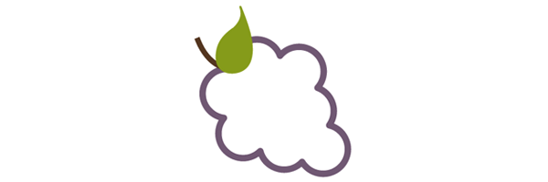

*[点击这里查看Demo效果](//codepen.io/jonitrythall/pen/210d9a8a7d3dba61b021c02b94575512)*

#### `stroke-linejoin`

`stroke-linejoin`定义了路径和基本形状连接处的风格。

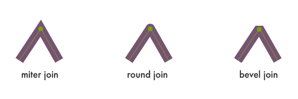

下面使用`stroke-linejoin`定义了葡萄形状连接处的风格为`bevel`：

	<svg>
    	<!--<path stroke-linejoin="bevel" <path for grapes> />-->
    	<!--<path <path for stem> />-->
    	<!--<path <path for leaf> />-->
  	</svg>

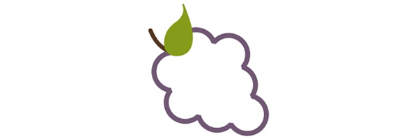

*[点击这里查看Demo效果](//codepen.io/jonitrythall/pen/b2b49681ed92c0a7063123421879d15d)*

##### `stroke-miterlimit`

当两条线相交于成一个角，并设置为`stroke-linejoin="miter"`，其中`stroke-miterlimit`属性允许指定这个角延伸的距离。

这个连接的长度被称为`miter`长度，它是从线的内角连接到外端的距离。

这个值是指`miter`长度受`stroke-width`的限制。

这个属性的最小的可能值是`1.0`。

第一个葡萄图形设置了`stroke-miterlimit="1.0"`，这将产生了一个斜角效果。第二个葡萄的图形设置了`stroke-miterlimit="4.0"`。

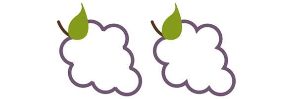

*[点击这里可以查看Demo效果](//codepen.io/jonitrythall/pen/a0afcecca7a8c19a305ff3edb2adddf1)*

#### `stroke-dasharray`

`stroke-dasharray`属性把路径变成了破折线，而不是实线。

在这个属性中，您可以指定破折线的长度，使用逗号或空格来分隔破折号之间的距离。

如果提供的值是奇数值，表示该列表值将会重复，以产生偶数个数值。比如`8,6,4`将变成`8,6,4,8,6,4`，如下图所示。

在这个值中只放置一个数字，就会在破折线之间的空间中产生等于相同长度的破折线。

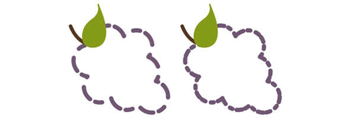

*[点击这里查看Demo效果](//codepen.io/jonitrythall/pen/0e6de428698ed9a202fb05fdac1c806c)*

第一个葡萄图形展示了一个偶数值时的葡萄图形效果：`stroke-dasharray="20,15,10,8"`。

#### `stroke-dashoffset`

`stroke-dashoffset`属性用来指定破折号之间的距离。

	<svg>
    	<!--<path stroke-dasharray="40,10" stroke-dashoffset="35" <path for grapes> />-->
    	<!--<path <path for stem> />-->
    	<!--<path <path for leaf> />-->
  	</svg>

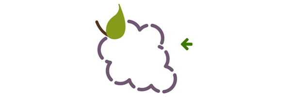

*[点击这里查看Demo效果](//codepen.io/jonitrythall/pen/ec8d136c05ac274f3343a7fd64bb2203)*

在上面的例子中，破折线设置了`40px`长度，以及`dashoffset`的值设置为`35px`。在路径的起始点，在`35px`到`40px`的破折线将不会出现，这就是为什么第一个破折号显得更短。

#### `stroke-opacity`

`stroke-opacity`属性用来设置描边的透明度。

他的值是`0`到`1`之间，其中`0`是表示描边完全透明，不可见。

## 第5节: `text`元素

`<text>`元素定义了由文本组成的图形。有许多属性选项可以定制文本图形，而且渐变、图案、剪切路径、蒙板和过滤器也可以应用在`text`元素之上。

SVG提供了能力强大的`<text>`元素，用于创建可伸缩的文本作为图形，而且易于在SVG代码中修改和编辑。

在使用本节中提到的示例时，要特别注意`viewport`尺寸。正如前面提到的，`viewport`将决定SVG的可见部分，有时有必要根据修改的细节来更改`viewport`。

### 基本属性

SVG的文本属性位于`<text>`元素内，该元素放置在`<svg>`元素内。通过这些属性，可以控制文本的一些基本样式，并在画布上完全呈现其映射的细节，从而完全控制它在屏幕上的效果。

#### `x`, `y`, `dx`, `dy`

`<text>`元素中的第一个字母是根据已创建的坐标系统中的`x`和`y`值来呈现的。`x`值决定了文本在`x`轴上开始位置处，而`y`值决定了文本底部的水平位置。

`x`和`y`在坐标系统中是绝对坐标，而`dx`和`dy`是相对坐标。当与`<tspan>`元素一起使用时，这一点特别方便，这将在接下来的部分中进行讨论。

	<svg width="620" height="100">
    	<text x="30" y="90" fill="#ED6E46" font-size="100" font-family="'Leckerli One', cursive">Watermelon</text>
  	</svg>

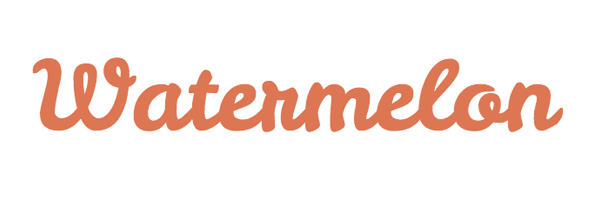

*[点击这里可以查看Demo效果](//codepen.io/jonitrythall/pen/e62394e43969fecb4269036260a3a575)*

上面的文本距SVG的`viewport`中左侧距离`30px`，而文本底部则从`viewport`顶部`90px`处。即：`x="30" y="90"`。

#### `rotate`

可以将旋转放置在单个字母（字符）或者整个元素上。

`rotate`属性中的单个值会导致每个符号在该值上旋转。一系列值也可以用于文本的每个字母，并为每个字母分配不同的旋转值。如果没有足够的值来匹配字母的数量，最后一个值将为其他字母设置旋转。

下面的文本通过`transform`给每个文本设置旋转效果，每个字母的旋转的值： `rotate="20,0,5,30,10,50,5,10,65,5"`。

	<svg width="600" height="250">
    	<text x="30" y="80" fill="#ED6E46" font-size="100" rotate="20,0,5,30,10,50,5,10,65,5" transform="rotate(8)" font-family="'Leckerli One', cursive">Watermelon</text>
  	</svg>

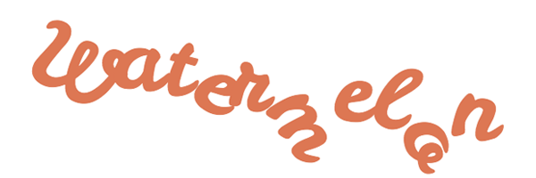

*[点击这里查看Demo效果](//codepen.io/jonitrythall/pen/d46fe22b170668927920220e13c1093f)*

#### `textLength`和`lengthAdjust`

`textLength`属性指定文本的长度。文本的长度将通过改变所提供的字符之间的空格来适应该属性中指定的长度。

下面的例子有一个`textLength`值为`900px`。得注意的是，字符之间的间距增加了，以填充这个空间。

	<svg width="950" height="100">
    	<text x="30" y="90" fill="#ED6E46" font-size="100" textLength="900" font-family="'Leckerli One', cursive">Watermelon</text>
  	</svg>

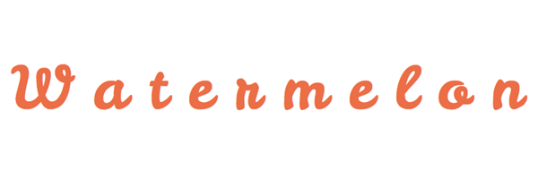

*[点击这里查看Demo效果](//codepen.io/jonitrythall/pen/3020091b8dbd6e77c22827d6c31e35fc)*

当和`lengthAdjust`属性一起使用时，可以指定字母间距和字形大小都应该调整以适应这些新的长度值。

`"spacing"`的值与上面的例子类似，在上面的例子中，字符的间距扩大到填充空间：`lengthAdjust=”spacing”`。

`"spacingAndGlyphs"`的值指定了间距和字形的大小来做相应的调整：`lengthAdjust="spacingAndGlyphs"`。

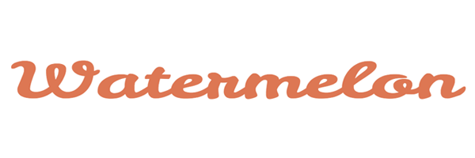

*[点击这里查看Demo效果](//codepen.io/jonitrythall/pen/dec7865c1584e965742d52151236db65)*

### `tspan`元素

`<tspan>`元素很重要，因为SVG目前不支持自动换行。`<tspan>`允许我们通过将某些单词或字符单独进行操，用来绘制多行文本。

而不是为这些额外的行定义一个新的坐标系统，`<tspan>`元素将这些新的文本行与上一行的文本关联起来。

`<tspan>`元素本身并不会输出可见的的东西，但是通过在元素中指定更多的细节，我们可以将该文本单独输出，并对其设计和定位有更多的控制。

在下面的示例中，`"are"`和`"delicious"`位于`<text>`元素的``元素中。通过在每个`span`中的`dy`，可以将这个词沿着`y`轴与前面的词关联起来。

虽然`"are"`的位置在`"Watermelons"`的`-30px`位置处，但`"delicious"`的位置是`50px`。

 	<svg width="775" height="500">
    	<text x="15" y="90" fill="#ED6E46" font-size="60" font-family="'Leckerli One', cursive"> Watermelons
      		<tspan dy="-30" fill="#bbc42a" font-size="80">are</tspan>
      		<tspan dy="50">delicious</tspan>
    	</text>
  	</svg>

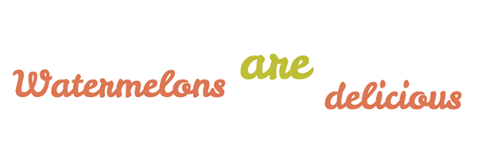

*[点击这里查看Demo效果](//codepen.io/jonitrythall/pen/ea83c21659cf118df5b5d64b14b2a1c9)*

你还可以通过一个列表值单独移二甲双胍每个字母，如下面的示例所示。字母和符号随后根据字母和符号的位置移动，`"delicious"`现在根据`"are"`中的`"e"`位置定位。

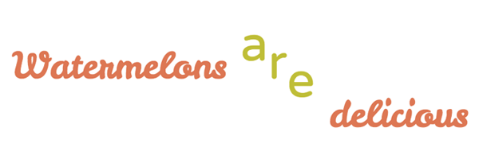

*[点击这里查看Demo效果](//codepen.io/jonitrythall/pen/943ca861a5154a2e2fbe3394d2031fda)*

包含`"are"`的`tspan`有以下`dy`值：`dy="-30 30 30"`。

### 间距属性

当在内联SVG中使用`<text>`元素来控制单词和字母的间距时，可以使用许多属性，类似于矢量图形软件的功能。

了解如何使用这些属性有助于确保图形完全按照预期显示。

#### `kerning`和`letter-spacing`

`kerning`指的是调整字符间距的过程。`kerning`属性允许我们根据使用的字体中包含的`kerning`来调整这个空间，或者设置一个独特的长度。

`auto`值表示字形间距应该基于所使用的字体中包含的`kerning`列表。

下面的例子中`kerning`的值为`auto`，在这个示例中，它没有可见的影响，因为它是默认值。

	<svg width="420" height="200">
    	<text x="2" y="50%" fill="#ef9235" font-size="100" font-family="'Raleway', sans-serif" font-weight="bold" kerning="auto">Oranges</text>
  	</svg>

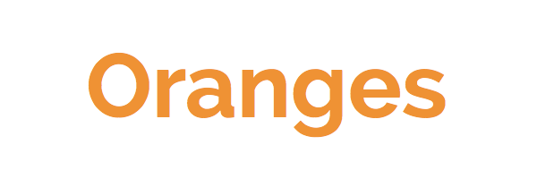

调整这些字符之间的长度可以简单地包括一个数值：`kerning="30"`。

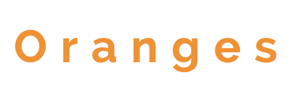

`inherit`的值也是有效的。

`letter-spacing`的值有`normal`、`<length>`和`inherit`。这里的数值与`kerning`的间距有相同的效果。`letter-spacing`的属性是已经从`kerning`生效的补充间距。

#### `word-spacing`

`word-spacing`属性是用来指定单词之间的间距。

	<svg width="750" height="200">
    	<text x="2" y="50%" fill="#ef9235" font-size="70" font-family="'Raleway', sans-serif" word-spacing="30">Oranges are Orange</text>
  	</svg>

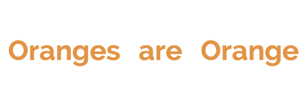

其他有效的值还包括`normal`(默认值)和`inherit`。

### `text-decoration`

`text-decoration`属性允许在SVG的文本图形上添加下划线，其值包括：`underline`、`overline`和`line-through`。

虽然绘制图形的顺序并不总是会对SVG图形输出产生影响，但是`text-decoration`方面顺序确实很重要。`text-decoration`所有值（除了`line-throught`之外），应该在文本填充和描边之前使用这个属性。

`line-through`应该在文本填充或描边后绘制，不然将会在文本的顶部呈现。

下面的效果是使用了`text-decoration="underline"`和`text-decoration="line-through"`。

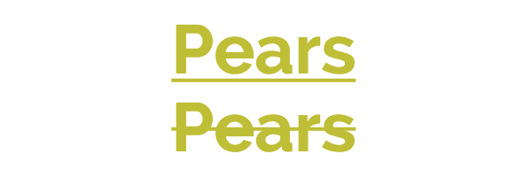

### 沿着路径的文本

正如前面提到的，内联SVG为我们提供了与矢量图形软件类似的高级定制选项。在SVG代码中，我们可以准确定位文本，就像我们希望它在屏幕上显示一样。

在进一步处理此操作时，SVG的`<text>`可以根据`<path>`元素，指定文本根据路径呈现文本。

#### `textPath`元素

`textPath`元素是这个特性所有魔法所在。虽然SVG的文本在`<text>`元素内，而`<textPath>`元素在`<text>`元素内。

这个`<textPath>`元素将调用所选择的`id`路径，它在`<defs>`元素中等待被使用。

基本语法如下：

	<svg>
    	<defs>
  			<path id="testPath" d="<....>"/>
  	    </defs>
       <text>
      		<textPath xlink:href="#testPath">Place text here</textPath>
       </text>
    </svg>

下面是代码中使用的向量路径：

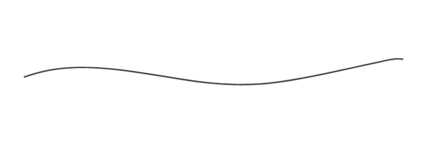

在矢量图形软件中生成此路径后，SVG的`<path>`元素代码本身（不包括如上所示的颜色），可以在`<svg>`中复制并放置在`<svg>`中，同时也显示在上面的代码中。

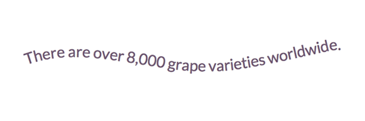

	<svg width="620" height="200">
    	<defs>
  			<path id="testPath" d="M3.858,58.607 c16.784-5.985,33.921-10.518,51.695-12.99c50.522-7.028,101.982,0.51,151.892,8.283c17.83,2.777,35.632,5.711,53.437,8.628 c51.69,8.469,103.241,11.438,155.3,3.794c53.714-7.887,106.383-20.968,159.374-32.228c11.166-2.373,27.644-7.155,39.231-4.449" />
  	    </defs>
     	<text x="2" y="40%" fill="#765373" font-size="30" font-family="'Lato', sans-serif">
     		<textPath xlink:href="#testPath">There are over 8,000 grape varieties worldwide.</textPath>
     	</text>
   	</svg>

##### `xlink:href`

The `xlink:href` attribute in a `<textPath>` allows us to reference the path to which the text will be rendered on.

`xlink:href`是`<textPath>`的属性，允许我们引用文本根据指定的路径呈现。

##### `startOffset`

`startOffset`属性表示从`path`开始时的文本偏移长度。`0%`的值表示`path`的起始点，而`100%`表示终点。

下面的例子有一个`20%`的`startoffset`，它推动文本在路径的`20%`处开始。当移动时，字体大小已经减少，以防止它从`viewport`中呈现出来。

通过`<use>`元素添加路径的描边颜色，可以帮助我们理解这里发生的事情。

	<svg width="620" height="200">
     	<defs>
  			<path id="testPath" d="M3.858,58.607 c16.784-5.985,33.921-10.518,51.695-12.99c50.522-7.028,101.982,0.51,151.892,8.283c17.83,2.777,35.632,5.711,53.437,8.628 c51.69,8.469,103.241,11.438,155.3,3.794c53.714-7.887,106.383-20.968,159.374-32.228c11.166-2.373,27.644-7.155,39.231-4.449" />
  		</defs>
    	<use xlink:href="#testPath" fill="none" stroke="#7aa20d" stroke-width="2"/>
    	<text x="2" y="40%" fill="#765373" font-size="20" font-family="'Lato', sans-serif">
      		<textPath xlink:href="#testPath" startOffset="20%">There are over 8,000 grape varieties worldwide.
      		</textPath>
    	</text>
  	</svg>

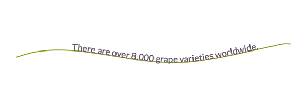

*[点击这里查看Demo效果](//codepen.io/jonitrythall/pen/b60cb49eb60d4db158fc9c81b1b6cd64)*

## 第6节: 高级特性——渐变，图案，剪辑路径

### 渐变

SVG渐变有两种类型：线性渐变和径向渐变。线性渐变是在直线上产生的，而径向渐变是圆形的。

一个非常简单的线性渐变就像下面这样：

	<svg>
    	<defs>
        	<linearGradient id="gradientName">
            	<stop offset="<%>" stop-color="<color>" />
            	<stop offset="<%>" stop-color="<color>" />
        	</linearGradient>
    	</defs>
	</svg>

`<svg>`包含一个`<defs>`元素，允许我们创建可重用的声明，以便稍后调用。这些定义输出用户并不可见，下到它们在描边或填充中被使用唯一的`id`时，才会在SVG的图形或`<text>`中被调用。这些图形或文本在`<svg>`元素中，但在`<defs>`元素之外。

一旦建立了一个渐变并分配一个`id`，它就可以通过SVG中的`fill`或`stroke`属性来调用。例如：`fill= "url(#gradientName)"`。

#### 线性渐变

线性渐变沿着一条直线改变颜色，在这个直线上定义的每个点将代表`<linearGradient>`元素内关联颜色。在每一个点上，颜色都是`100%`的饱和，中间的空间表示从一种颜色过渡到下一种颜色。

##### 停止节点

`<stop>`节点可以使用`stop-opacity="<value>"`来设置透明度。

下面是一个简单的线性渐变的示例代码，应用于矩形的两个颜色的线性渐变：

	<svg width="405" height="105">
    	<defs>
      		<linearGradient id="Gradient1" x1="0" y1="0" x2="100%" y2="0">
        		<stop offset="0%" stop-color="#BBC42A" />
        		<stop offset="100%" stop-color="#ED6E46" />
      		</linearGradient>
    	</defs>
    	<rect x="2" y="2" width="400" height="100" fill= "url(#Gradient1)" stroke="#333333" stroke-width="4px" />
  	</svg>

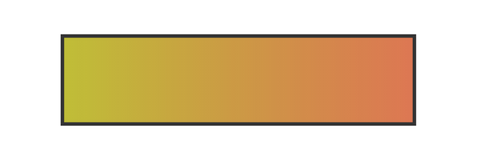

`offset`用来指定线性渐变的`stop-color`的位置。

##### `x1`, `y1`, `x2`, `y2`

`x1`，`y1`，`x2`和`y2`属性值表示渐变停止（颜色变化）映射的开始和结束点。这些百分数将沿适当的轴分别绘制渐变。

`100%`的`y`的值和`0`的`x`值将产生水平渐变，反之则会产生垂直渐变。将两个值设置为`100%`（或`0`之外的任何值）将会创建一个倾斜的渐变。

##### `gradientUnits`

`gradientUnits`属性定义了`x1`、`x2`、`y1`和`y2`值的坐标系统。这里有两个选项：`userSpaceOnUse`或
`objectBoundingBox`。`userSpaceOnUse`使用的是坐标系统中的绝对单元值，而`objectBoundingBox`（默认值）在SVG图形本身的范围建立这个系统（相对坐标值）。

##### `spreadMethod`

`spreadMethod`属性的值指定渐变如何在目标范围内展开或结束。如果渐变不在图形的填充中使用，`spreadMethod`将会决定渐变应该如何覆盖那个空白区域。这里有三个值可选：`pad`、`repeat`和`reflect`。

`pad`（默认值）的值指定渐变的第一个和最后一个颜色在未被发现的目标区域的其余部分展开。`repeat`的值指定渐变从一开始就重复使用这个模式。`reflect`的值指定渐变的从开始到结束的渐变模式，连续不断的执行。

下面的渐变的开始和结束点是：`x1="20%" y1="30%" x2="40%" y2="80%"`。

##### `gradientTransform`

`gradientTransform`属性是可选的，并允许给渐变添加旋转等功能。

##### `xlink:href`

`xlink:href`属性允许你调用另一个渐变的`id`所有的信息，但你也可以包含不同的值。

	<linearGradient id="repeat" xlink:href="#Gradient-1” spreadMethod="repeat" />

渐变从本节点开始就继承了第一个渐变的细节，但是有一个`spreadMethod`值。

#### 径向渐变

`<radialGradient>`的大多数属性与`<linearGradient>`相同，除非有不同的坐标系统。

##### `cx`, `cy`, `r`

`cx`，`cy`和`y`属性定义了圆的最外层，而渐变的`100%`的`stop-color`将这个值映射到圆的周长上。`cx`和`cy`定义了径向渐变的圆心，而`r`则是设置径向渐变的半径。

##### `fx`, `fy`

`fx`和`fy`属性代表了渐变的焦点，或者说是最内层圆的坐标。本质上，渐变的中心不需要它的焦点，可以用这些值来改变它。

默认情况下，径向渐变的焦点将能圆的中心为中心，焦点属性可以改变这一点。以下图像的焦点值为：`fx="95%" fy="70%"`：

	<svg width="850px" height="300px">
    	<defs>
      		<radialGradient id="Gradient2" cy="60%" fx="95%" fy="70%" r="2">
        		<stop offset="0%" stop-color="#ED6E46" />
    			<stop offset="10%" stop-color="#b4c63b" />
    			<stop offset="20%" stop-color="#ef5b2b" />
        		<stop offset="30%" stop-color="#503969" />
        		<stop offset="40%" stop-color="#ab6294" />
        		<stop offset="50%" stop-color="#1cb98f" />
        		<stop offset="60%" stop-color="#48afc1" />
        		<stop offset="70%" stop-color="#b4c63b" />
        		<stop offset="80%" stop-color="#ef5b2b" />
        		<stop offset="90%" stop-color="#503969" />
        		<stop offset="100%" stop-color="#ab6294" />
      		</radialGradient>
    	</defs>
    	<text x="20%" y="75%" fill= "url(#Gradient2)" font-family= "'Signika', sans-serif" font-size="200">Cherry</text>
  	</svg>

在这个示例中，焦点转移到图像的右下角。

### 图案

图案通常被认为是用`fill`和`stroke`来给SVG图形来填充或描边更复杂的图形。理解图案的基本语法可以使这些看起来复杂的图案变得更容易。

下面是用于图案来填充矩形的基本语法：

	<svg width="220" height="220">
    	<defs>
      		<pattern id="basicPattern" x="10" y="10" width="40" height="40" patternUnits="userSpaceOnUse">
       			<circle cx="20" cy="20" r="20" fill= "#BBC42A" />
    		</pattern>
  		</defs>
  		<rect x="10" y="10" width="200" height="200" stroke="#333333" stroke-width="2px" fill="url(#basicPattern)" />
  	</svg>

#### 基本属性

图案的属性和值定义了画布、设计和整体位置。图案可以由路径或图形组成，可以绘制文本，甚至可以嵌套在另一个图案中。

##### `x`, `y`, `width`, `height`

`<pattern>`元素的`x`和`y`属性定义了图案从图形哪个位置开始。在`<pattern>`元素内使用`width`和`height`定义了图案的宽度和高度。

上面引用的`basicPattern`包含了`x="10" y="10" width="40" height="40"`。表示从`x`轴的`10px`，`y`轴的`10px`处开始，创建一个`40px`的宽和`40px`的高的画布。

##### `patternUnits`

`patternUnits`属性定义了`x`、`y`、`width`和`height`所引用的坐标。这里有两个选项：`userSpaceOnUse`和`objectBoundingBox`（默认值）。

`userSpaceOnUse`在图案坐标系统由引用`<pattern>`元素的坐标系统决定，而`objectBoundingBox`则建立映射坐标系统基于该图案所应用的元素的容器。

##### `patternContentUnits`

`patternContentUnits`属性的值与`patternUnits`的值相同，只是现在为图案本身的内容定义了坐标系统。

与`patternUnits`不同，这个值默认为`userSpaceOnUse`，这意味着除非其中一个或两个属性被指定为`<pattern>`中所绘制的形状，否则它们将被绘制在不同的坐标系统中，而不是`<pattern>`元素所使用的。

在`<pattern>`元素中定义`patternUnits="userSpaceOnUse"`简化了这个过程，并确保了一个一致的工作区域。

#### 图案嵌套

图案也可以嵌套，以创建更加独特和详细的设计。

下面是图案嵌套的一个基本结构：

	<svg width="204" height="204">
  		<defs>
    		<pattern id="circlePattern"
             x="4" y="4" width="75" height="75"
             patternUnits="userSpaceOnUse">
      			<circle cx="12" cy="12" r="8"
            stroke="#ed6e46" stroke-width="3" fill="#765373" />
    		</pattern>
			<pattern id="rectPattern"
             x="10" y="10" width="50" height="50"
             patternUnits="userSpaceOnUse">
      			<rect x="2" y="2" width="30" height="30"
              stroke="#bbc42a" stroke-width="3" fill="url(#circlePattern)" />
    		</pattern>
  		</defs>
  		<rect x="2" y="2" width="200" height="200"
      stroke="#333333" stroke-width="3" fill="url(#rectPattern)" />
	</svg>

`<defs>`元素包含两个模式。在`<defs>`中，矩形的图案是通过`fill`来调用圆形图案，而主矩形则通过`fill`来调用矩形图案，并将主矩形的内部绘制成嵌套的图案。

### 剪切路径

剪切咱径限制了将绘制图形应用到SVG的区域。在剪切路径设置的范围之外的任何区域都不会被渲染。

为了演示这个功能的特性，让我们使用一个包含`“Apple”`文本的裁剪路径，它被应用于一个番茄矩形和绿色圆圈。

下面是没有使用剪切路径的图形，设置超出`viewport`的范围。

现在，我们来看看`Apple`文本应用于画布的代码：

 	<svg width="400px" height="200px">
    	<clipPath id="clip-text">
      		<text x="0" y="50%" fill="#f27678" font-size="120px" font-family=" 'Signika', sans-serif">Apples</text>
    	</clipPath>
    	<rect x="0" y="0" width="200" height="200" fill="#ed6e46" clip-path="url(#clip-text)" />
    	<circle cx="310" cy="100" r="135" fill="#bbc42a" clip-path="url(#clip-text)" />
  	</svg>

剪切路径在`<clipPath>`元素中定义，然后通过引用其唯一的`id`来调用这两个形状。

## 总结

编写内联SVG是一个非常有用的编辑功能，并使用我们能够独立地访问所有图形元素。在这段代码中，我们生成的图形在不丢失图像质量的情况下，可以增加搜索功能和增强可访问性。

它可能需要我们花一些时间掌握修改SVG的能力，但一旦你掌握了这些能力，并且使你的代码尽可能的短和高效，那么就可以开始去[探索SMIL动画](//www.w3.org/TR/smil-animation)和尝试[用CSS给SVG元素添加样式](//developer.mozilla.org/en-US/docs/Web/Guide/CSS/Getting_started/SVG_and_CSS)。

希望这个指南有一定的参考价值，也能让你理解和操作内联SVG提供一定的灵感。

有关于相关的更新，请访问[本书的网站](//svgpocketguide.com)，如果你有任何关于这本书的问题和评论，可以在[Twitter](//twitter.com/JoniTrythall)上或者通过电子邮件[info@jonibologna.com](mailto:info@jonibologna.com)与我沟通。

> 特别声明：[简介](#简介)、[第1节： 文档组织](#第1节-文档组织)和[第2节：基本图形和路径](#第2节-基本图形和路径)由[沪江技术学院](//hujiangtech.github.io/tech/)翻译整理。